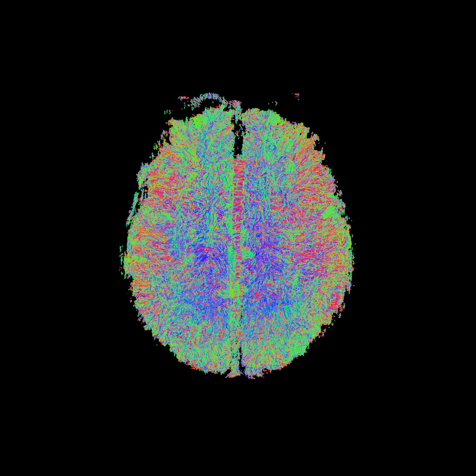
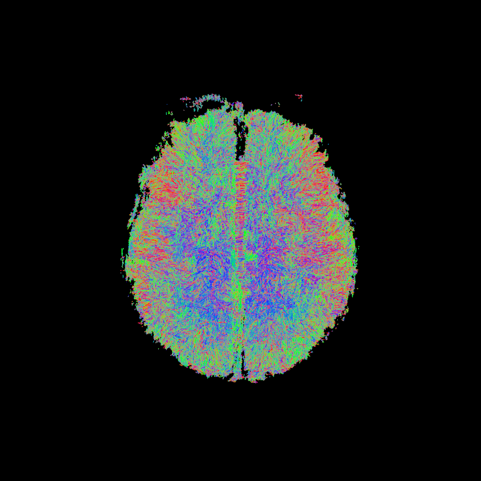
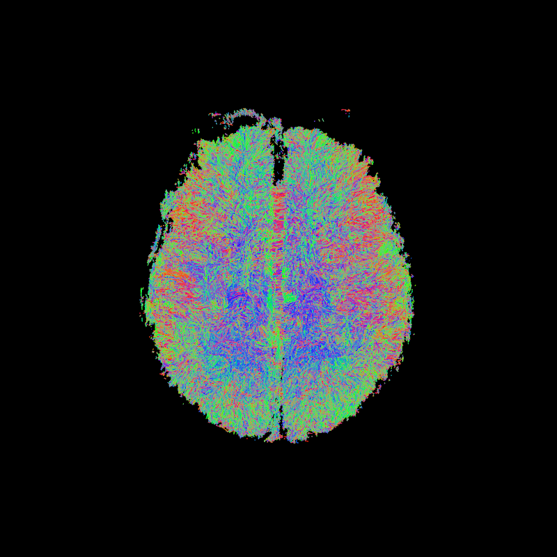

## Probabilistic Tractography

Probabilistic fiber tracking is a way of reconstructing the white matter
structural connectivity using diffusion MRI data. Much like deterministic fiber
tracking, the probabilistic approach follows the trajectory of a possible
pathway in a step-wise fashion and propagating streamlines based on the local
orientations reconstructed at each voxel.

Streamline propagation is, in essence, a numerical analysis integration
problem. The problem lies in finding a curve that joins a set of discrete local
directions. As such, it takes the form of a differential equation problem of
the form:
{:class="img-responsive"} \
Streamline propagation differential equation

where the curve $r(s)$ needs to be solved for.

In probabilistic tracking, however, the tracking direction at each point along
the path is chosen at random from a distribution of possible directions, and
thus is no longer deterministic. The distribution at each point is different
and depends on the observed diffusion data at that point. The distribution of
tracking directions at each point can be represented as a probability mass
function (PMF) if the possible tracking directions are restricted to a set of
points distributed on a sphere.

Like their deterministic counterparts, probabilistic tracking methods start
propagating streamlines from a *seed map*, which contains a number of
coordinates per voxel to initiate the procedure. The higher the number of seeds
per voxel (i.e. the see density), the larger the number of potentially
recovered long-range connections. However, this comes at the cost of a longer
running time.

This lesson builds on top of the results of the CSD local orientation
reconstruction method presented in the previous lesson.

~~~
import os

import nibabel as nib
import numpy as np

from bids.layout import BIDSLayout

from dipy.core.gradients import gradient_table
from dipy.data import get_fnames
from dipy.io.gradients import read_bvals_bvecs
from dipy.io.image import load_nifti, load_nifti_data
from dipy.reconst.csdeconv import (ConstrainedSphericalDeconvModel,
                                   auto_response)
from dipy.tracking import utils
from dipy.tracking.local_tracking import LocalTracking
from dipy.tracking.streamline import Streamlines
from dipy.tracking.stopping_criterion import ThresholdStoppingCriterion
from dipy.viz import window, actor, colormap

dwi_layout = BIDSLayout('../../data/ds000221/derivatives/uncorrected_topup_eddy/', validate=False)
gradient_layout = BIDSLayout('../../data/ds000221/sub-010006/ses-01/dwi/', validate=False)

dwi_fname = dwi_layout.get(subject=subj, suffix='dwi', extension='nii.gz', return_type='file')[0]
bval_fname = gradient_layout.get(subject=subj, suffix='dwi', extension='bval', return_type='file')[0]
bvec_fname = gradient_layout.get(subject=subj, suffix='dwi', extension='bvec', return_type='file')[0]

dwi_img = nib.load(dwi)
affine = dwi_img.affine

gt_bvals, gt_bvecs = read_bvals_bvecs(bval, bvec)
gtab = gradient_table(gt_bvals, gt_bvecs)

from dipy.reconst import dti
from dipy.segment.mask import median_otsu
from dipy.tracking import utils

dwi_data = dwi_img.get_fdata()
dwi_data, dwi_mask = median_otsu(dwi_data, vol_idx=[0], numpass=1) # Specify the volume index to the b0 volumes

dti_model = dti.TensorModel(gtab)
dti_fit = dti_model.fit(dwi_data, mask=dwi_mask) # This step may take a while

fa_img = dti_fit.fa
seed_mask = fa_img.copy()
seed_mask[seed_mask>=0.2] = 1
seed_mask[seed_mask<0.2] = 0

seeds = utils.seeds_from_mask(seed_mask, affine=affine, density=1)

response, ratio = auto_response(gtab, dwi_data, roi_radius=10, fa_thr=0.7)
csd_model = ConstrainedSphericalDeconvModel(gtab, response, sh_order=6)
csd_fit = csd_model.fit(dwi_data, mask=seed_mask)
~~~
{: .language-python}

Tracking methods are provided with a criterion to stop propagating streamlines
beyond non-white matter tissues. One way to do this is to use the Generalized
Fractional Anisotropy (GFA). Much like the Fractional Anisotropy issued by the
DTI model measures anisotropy, the GFA uses samples of the ODF to quantify the
anisotropy of tissues, and hence, it provides an estimation of the underlying
tissue type.

~~~
from dipy.reconst.shm import CsaOdfModel

csa_model = CsaOdfModel(gtab, sh_order=6)
gfa = csa_model.fit(dwi_data, mask=seed_mask).gfa
stopping_criterion = ThresholdStoppingCriterion(gfa, .25)

# Create the directory to save the results
out_dir = '../../data/ds000221/derivatives/dwi/tractography/sub-%s/ses-01/dwi/' % subj

if not os.path.exists(out_dir):
    os.makedirs(out_dir)

# Save the GFA
gfa_img = nib.Nifti1Image(gfa.astype(np.float32), affine)
nib.save(gfa_img, os.path.join(out_dir, 'gfa.nii.gz'))

# Plot the GFA
import matplotlib.pyplot as plt
%matplotlib inline

fig, axes = plt.subplots()
axes.imshow(gfa[:,:,gfa.shape[-1]//2], cmap="gray", origin="lower")
axes.axis("off")
plt.show()
~~~
{: .language-python}

The Fiber Orientation Distribution (FOD) of the CSD model estimates the
distribution of small fiber bundles within each voxel. We can use this
distribution for probabilistic fiber tracking. One way to do this is to
represent the FOD using a discrete sphere. This discrete FOD can be used by the
``ProbabilisticDirectionGetter`` as a PMF for sampling tracking directions. We
need to clip the FOD to use it as a PMF because the latter cannot have negative
values. Ideally, the FOD should be strictly positive, but because of noise
and/or model failures sometimes it can have negative values.

The set of possible directions to choose to propagate a streamline is
restricted by a cone angle $\theta$, named `max_angle` in `DIPY`'s
`ProbabilisticDirectionGetter::from_pmf` method.

Another relevant parameter of the propagation is the step size, which dictates
how much the propagation will advance to the next point. Note that it is a real
number, since the tracking procedure operates in physical coordinates.

Note that the `LocalTracking` class accepts a `StoppingCriterion` class
instance as its second argument, and thus a different criterion can be used if
the GFA criterion does not fit into our framework, or if different data is
available in our workflow.

~~~
from dipy.direction import ProbabilisticDirectionGetter
from dipy.data import small_sphere
from dipy.io.stateful_tractogram import Space, StatefulTractogram
from dipy.io.streamline import save_tractogram

fod = csd_fit.odf(small_sphere)
pmf = fod.clip(min=0)
prob_dg = ProbabilisticDirectionGetter.from_pmf(pmf, max_angle=30.,
                                                sphere=small_sphere)
streamline_generator = LocalTracking(prob_dg, stopping_criterion, seeds,
                                     affine, step_size=.5)
streamlines = Streamlines(streamline_generator)
sft = StatefulTractogram(streamlines, dwi_img, Space.RASMM)

# Save the tractogram
save_tractogram(sft, "tractogram_probabilistic_dg_pmf.trk")

# Plot the tractogram
scene = window.Scene()
scene.add(actor.line(streamlines, colormap.line_colors(streamlines)))
prob_tractogram_dg_pmf_scene_arr = window.snapshot(
    scene, fname=os.path.join(out_dir, 'tractogram_probabilistic_dg_pmf.png'),
    size=(200, 200), offscreen=True)

fig, axes = plt.subplots()
axes.imshow(prob_tractogram_dg_pmf_scene_arr, origin="lower")
axes.axis("off")
plt.show()
~~~
{: .language-python}

{:class="img-responsive"} \
Corpus Callosum using probabilistic direction getter from PMF

One disadvantage of using a discrete PMF to represent possible tracking
directions is that it tends to take up a lot of memory (RAM). The size of the
PMF, the FOD in this case, must be equal to the number of possible tracking
directions on the hemisphere, and every voxel has a unique PMF. In this case
the data is ``(81, 106, 76)`` and ``small_sphere`` has 181 directions so the
FOD is ``(81, 106, 76, 181)``. One way to avoid sampling the PMF and holding it
in memory is to build the direction getter directly from the spherical harmonic
(SH) representation of the FOD. By using this approach, we can also use a
larger sphere, like ``default_sphere`` which has 362 directions on the
hemisphere, without having to worry about memory limitations.

~~~
from dipy.data import default_sphere

prob_dg = ProbabilisticDirectionGetter.from_shcoeff(csd_fit.shm_coeff,
                                                    max_angle=30.,
                                                    sphere=default_sphere)
streamline_generator = LocalTracking(prob_dg, stopping_criterion, seeds,
                                     affine, step_size=.5)
streamlines = Streamlines(streamline_generator)
sft = StatefulTractogram(streamlines, dwi_img, Space.RASMM)

# Save the tractogram
save_tractogram(sft, "tractogram_probabilistic_dg_sh.trk")

# Plot the tractogram
scene = window.Scene()
scene.add(actor.line(streamlines, colormap.line_colors(streamlines)))
prob_tractogram_dg_sh_scene_arr = window.snapshot(
    scene, fname=os.path.join(out_dir, 'tractogram_probabilistic_dg_sh.png'),
    size=(800, 800), offscreen=True)

fig, axes = plt.subplots()
axes.imshow(prob_tractogram_dg_sh_scene_arr, origin="lower")
axes.axis("off")
plt.show()
~~~
{: .language-python}

{:class="img-responsive"} \
Corpus Callosum using probabilistic direction getter from SH

Not all model fits have the ``shm_coeff`` attribute because not all models use
this basis to represent the data internally. However we can fit the ODF of any
model to the spherical harmonic basis using the ``peaks_from_model`` function.

~~~
from dipy.direction import peaks_from_model

peaks = peaks_from_model(csd_model, dwi_data, default_sphere, .5, 25,
                         mask=seed_mask, return_sh=True, parallel=True)
fod_coeff = peaks.shm_coeff

prob_dg = ProbabilisticDirectionGetter.from_shcoeff(fod_coeff, max_angle=30.,
                                                    sphere=default_sphere)
streamline_generator = LocalTracking(prob_dg, stopping_criterion, seeds,
                                     affine, step_size=.5)
streamlines = Streamlines(streamline_generator)
sft = StatefulTractogram(streamlines, dwi_img, Space.RASMM)

# Save the tractogram
save_tractogram(sft, "tractogram_probabilistic_dg_sh_pmf.trk")

# Plot the tractogram
scene = window.Scene()
scene.add(actor.line(streamlines, colormap.line_colors(streamlines)))
window.record(scene, out_path='tractogram_probabilistic_dg_sh_pmf.png',
              size=(800, 800))
prob_tractogram_dg_sh_pmf_scene_arr = window.snapshot(
    scene,
    fname=os.path.join(out_dir, 'tractogram_probabilistic_dg_sh_pmf.png'),
    size=(800, 800), offscreen=True)

fig, axes = plt.subplots()
axes.imshow(prob_tractogram_dg_sh_pmf_scene_arr, origin="lower")
axes.axis("off")
plt.show()
~~~
{: .language-python}

{:class="img-responsive"} \
Corpus Callosum using probabilistic direction getter from SH (peaks_from_model)

> ## Tip: Making sure your tractogram is well aligned with the data
>
> If for whatever reason the anatomical and diffusion images were not correctly
> aligned, you may find that your tractogram is not well aligned with the
> anatomical data. This may also happen derived from the different formats in
> which a tractogram is saved/loaded, some conventions specifying the origin at
> the voxel corner and other specifying it at the center of the voxel.
> Visualizing the computed features is always recommended. There are some tools
> that allow to ensure that the matrices specifying the orientation and
> positioning of the data should be correct.
>
> `MRtrix`'s `mrinfo` command can be used to visualize the affine matrix of a
> `NIfTI` file as:
>
> `mrinfo dwi.nii.gz`
>
> which would output something like:
>
> ************************************************
> Image:               "/data/dwi.nii.gz"
> ************************************************
>   Dimensions:        90 x 108 x 90 x 33
>   Voxel size:        2 x 2 x 2 x 1
>   Data strides:      [ -1 -2 3 4 ]
>   Format:            NIfTI-1.1 (GZip compressed)
>   Data type:         signed 16 bit integer (little endian)
>   Intensity scaling: offset = 0, multiplier = 1
>   Transform:                    1          -0           0      -178
>                                -0           1           0      -214
>                                -0          -0           1        -0
>
> Similarly, for your tractograms, you may use the command `track_info` from
> `TrackVis`' `Diffusion Toolkit` set of command-line tools:
>
> `trk_info tractogram.trk`
>
> which would output something like:
>
> ID string:           	TRACK
> Version:             	2
> Dimension:           	180 216 180
> Voxel size:          	1 1 1
> Voxel order:         	LPS
> Voxel order original:	LPS
> Voxel to RAS matrix:
> 	   -1.0000     0.0000     0.0000     0.5000
> 	    0.0000    -1.0000     0.0000     0.5000
> 	    0.0000     0.0000     1.0000    -0.5000
> 	    0.0000     0.0000     0.0000     1.0000
>
> Image Orientation:	1.0000/0.0000/0.0000/0.0000/1.0000/0.0000
> Orientation patches: 	none
> Number of scalars:	0
> Number of properties:	0
> Number of tracks:	200433
>
> Note that, a `TRK` file contains orientational and positional information. If
> you choose to store your tractograms using the `TCK` format, this information
> will not be contained in the file. To see the file header information you may
> use the `MRtrix` `tckinfo` command:
>
> `tckinfo tractogram.tck`
>
> which would output something like:
>
> ***********************************
>  Tracks file: "/data/tractogram.tck"
>    count:                0000200433
>    dimensions:           (180, 216, 180)
>    voxel_order:          LPS
>    voxel_sizes:          (1.0, 1.0, 1.0)
>
{: .callout}


