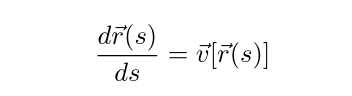

## Local tractography

Local tractography algorithms follow 2 general principles:
1. Estimate the fiber orientation, and
1. Follow along these orientations to generate/propagate the streamline.

Streamline propagation is, in essence, a numerical analysis integration
problem. The problem lies in finding a curve that joins a set of discrete local
directions. As such, it takes the form of a differential equation problem of
the form:
{:class="img-responsive"} \
Streamline propagation differential equation

where the curve $r(s)$ needs to be solved for.

To perform conventional local fiber tracking, three things are needed beyond the
propagation method itself:
1. A method for getting local orientation directions from a diffusion MRI
  dataset (e.g. diffusion tensor).
1. A set of seeds from which to begin tracking.
1. A method for identifying when to stop tracking.

Different alternatives have been proposed for each step depending on the
available data or computed features.

When further context data (e.g. tissue information) is added to the above to
perform the tracking process, the tracking method is considered to fall into the
*Anatomically-Constrained Tractography* (Smith et al. 2012) family of methods.


