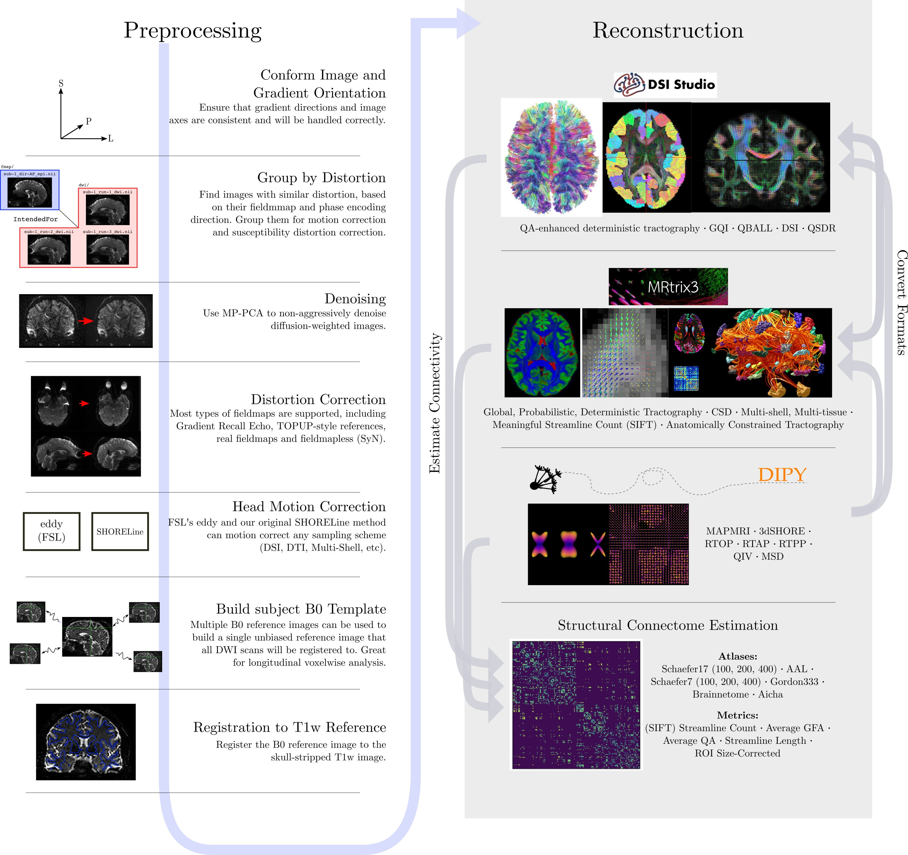
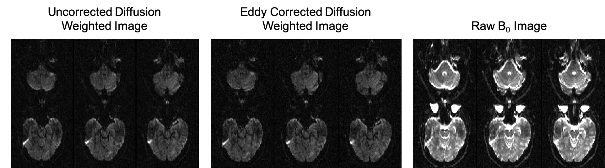
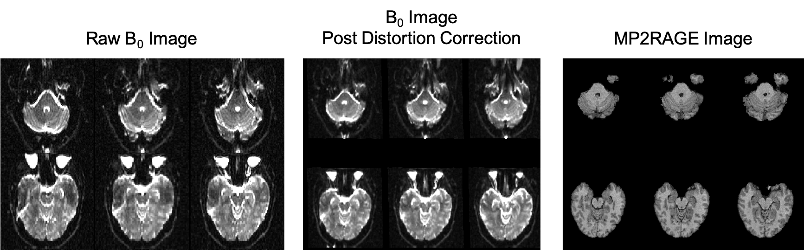

## Diffusion Preprocessing

Diffusion preprocessing typically comprises of a series of steps and is dependent on the data acquisition protocol. For the purposes of these lessons, the diffusion data has already been preprocessed and made available to use. Preprocessing is performed using a few well-known software packages (e.g. FSL, ANTS) and is chosen based on the acquisition protocol of the dataset <code>ds000030</code>.

This dataset contains single shell data with one b0 image. This image is the volume of the diffusion series. There are 64 volumes with diffusion weighting.

Here is an example preprocessing workflow from qsiprep:

Like fMRI preprocessing, dMRI has some of the same challenges and some unique [ones](https://www.ncbi.nlm.nih.gov/pmc/articles/PMC3366862/).

Our preprocessing of this data will consist of two steps:
1. Eddy current distortion correction
2. Registration to T1.

The first preprocessing step performed was the correction for eddy-current induced distortion and subject movement using FSL's <code>eddy</code>.

Diffusion gradients create distortions that vary with gradient strength and direction. This results in images from the same acquisition that are at different points in space. <code>eddy</code> reads the gradient table and estimates the distortions image by image and corrects them so all images are in the same space as the b0 image. This can be seen below:

The final step to our diffusion processing is registration to the T1w image. This is important because the diffusion data is acquired using echo planar imaging or EPI. This method allows us to image quickly but introduces distortions in the images in addition to the eddy current distortions. If we do not correct for these, the bvec files will be incorrect relative to the image we are analyzing as they are in scanner space. This was completed with the ANTS command <code>antsIntermodalityIntrasubject.sh</code>. This performs rigid, affine, and non-linear registration which corrects for the inter-sequence distortions. Lets looks at the results of this below:

### Notes
Preprocessing notes:
1. If we had more than one b0 image we could estimate and perform motion correction on our diffusion dataset.
2. Non-linear T1 registration is the crudest method for undistorting data, you can also use a fieldmap or acquire the data using two opposite phase encode directions and estimate the distortions from that.


