## Diffusion Tensor Imaging (DTI)

Diffusion tensor imaging or "DTI" refers to images describing diffusion with a tensor model. DTI is derived from preprocessed diffusion weighted imaging (dwi) data. First proposed by Basser and colleagues ([Basser, 1994](https://www.ncbi.nlm.nih.gov/pubmed/8130344)), the diffusion tensor model describes diffusion characteristics within an imaging voxel. This model has been very influential in demonstrating the utility of the diffusion MRI in characterizing the microstructure of white matter and the biophysical properties (inferred from local diffusion properties). The DTI model is still a commonly used model to investigate white matter.

The tensor models the diffusion signal mathematically as:

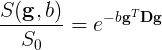 {:class="img-responsive"}

Where 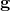 is a unit vector in 3D space indicating the direction of measurement and b are the parameters of the measurement, such as the strength and duration of diffusion-weighting gradient. 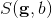 is the diffusion-weighted signal measured and 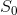 is the signal conducted in a measurement with no diffusion weighting. 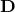 is a positive-definite quadratic form, which contains six free parameters to be fit. These six parameters are:

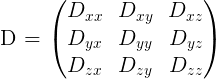 {:class="img-responsive"}

The diffusion matrix is a variance-covariance matrix of the diffusivity along the three spatial dimensions. Note that we can assume that the diffusivity has antipodal symmetry, so elmenets across the diagonal of the matrix are equal. For example: 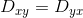. This is why there are only 6 free parameters to estimate here.

Tensors are represented by ellipsoids characterized by calculated eigenvalues (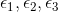) and eigenvectors (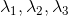) from the previously described matrix. The computed eigenvalues and eigenvectors are normallyed sorted in descending magnitude (ie. 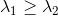).

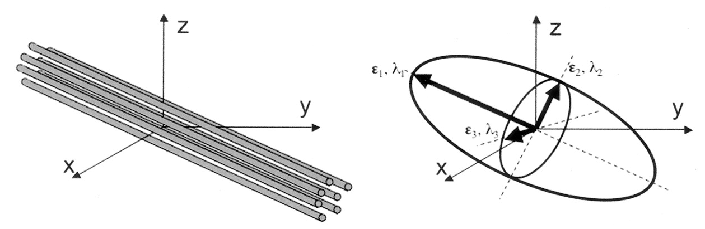 {:class="img-responsive"}
_Adapted from Jelison et al., 2004_

In the following example, we will walk through how to model a diffusion dataset. While there are a number of diffusion models, many of which are implemented in <code>Dipy</code>. However, for the purposes of this lesson, we will focus on the tensor model described above.

### Reconstruction with the `dipy.reconst` module

The <code>reconst</code> module contains implementations of the following models:

* Tensor (Basser et al., 1994)
* Constrained Spherical Deconvolution (Tournier et al. 2007)
* Diffusion Kurtosis (Jensen et al. 2005)
* DSI (Wedeen et al. 2008)
* DSI with deconvolution (Canales-Rodriguez et al. 2010)
* Generalized Q Imaging (Yeh et al. 2010)
* MAPMRI (Ozarsalan et al. 2013)
* SHORE (Ozarsalan et al. 2008)
* CSA (Aganj et al. 2009)
* Q ball (Descoteaux et al. 2007)
* OPDT (Tristan-Vega et al. 2010)
* Sparse Fascicle Model (Rokem et al. 2015)

The different algorithms implemented in the module all share a similar conceptual structure:

* <code>ReconstModel</code> objects (e.g., <code>TensorModel</code>) carry the parameters that are required in order to fit a model. For example, the directions and magnitudes of the gradients that were applied in the experiment. The objects all have a <code>fit</code> method, which takes in data, and emites a <code>ReconstFit</code> object. This is where a lot of the heavy lifting of the processing will take place.
* <code>ReconstFit</code> objects carry the model that was used to generate the object. They also include the parameters that were estimated during fitting of the data. They have methods to caclulate derived statistics, which can differ from model to model. All objects also have an orientation distribution function (<code>odf</code>), and most (but not all) contain a <code>predict</code> method, which enables the prediction of another dataset based on the current gradient table.

### Reconstruction with the DTI Model

Let's get started! First, we will need to grab the **preprocessed** dwi files and load them! We will also load in the anatomical image to use as a reference later on.

~~~
from bids.layout import BIDSLayout
from dipy.io.gradients import read_bvals_bvecs
from dipy.core.gradients import gradient_table
from nilearn import image as img
import nibabel as nib

layout = BIDSLayout("../data/ds000030/derivatives", validate=False)

t1 = layout.get(subject='10788', suffix='T1w', extension='nii.gz', return_type='file')[0]
dwi = layout.get(subject='10788', suffix='preproc', extension='nii.gz', return_type='file')[0]
bval = layout.get(subject='10788', suffix='preproc', extension='bval', return_type='file')[0]
bvec = layout.get(subject='10788', suffix='preproc', extension='bvec', return_type='file')[0]

t1_data = img.load_img(t1)
dwi_data = img.load_img(dwi)

gt_bvals, gt_bvecs = read_bvals_bvecs(bval, bvec)
gtab = gradient_table(gt_bvals, gt_bvecs)
~~~
{: .language-python}

Next, we will need to create the tensor model using our gradient table, and then fit the model using our data! We start by creating a mask from our data. We then apply this mask to avoid calculating the tensors in the background of the image! This can be done using dipy's mask module. Then we will fit out data! 

~~~
import dipy.reconst.dti as dti
from dipy.segment.mask import median_otsu

dwi_data = dwi_data.get_data() 
dwi_data, dwi_mask = median_otsu(dwi_data, vol_idx=[0], numpass=1) 

dti_model = dti.TensorModel(gtab)
dti_fit = dti_model.fit(dwi_data, mask=dwi_mask) # This step may take a while
~~~
{: .language-python}

The fit method creates a <code>TensorFit</code> object which contains the fitting parameters and other attributes of the model. A number of quantitative scalar metrics can be derived from the eigenvalues! In this tutorial, we will cover fractional anisotropy, mean diffusivity, axial diffusivity, and radial diffusivity. Each of these scalar metrics were calculated in the previous fitting step! 